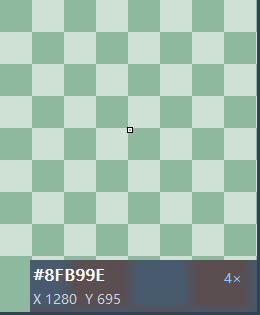
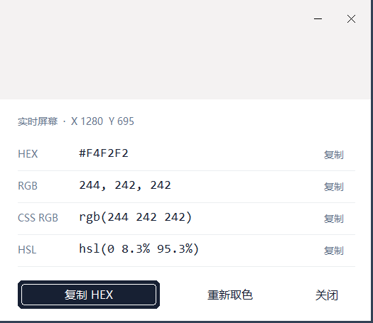

# Color Picker

常驻系统托盘的 Windows 原生取色工具。随时选取桌面像素，冻结并放大局部画面，精准取色后将色值复制到设计工具或代码中。

[下载 Windows 版本](https://github.com/ghostroller/color-picker/releases) · [English](README.md) · [界面预览](docs/ui-preview.md)

## 快速开始

1. 从 [Releases](https://github.com/ghostroller/color-picker/releases) 下载 Windows x64 **安装包**（`*-setup.exe`）或**便携 ZIP**。
2. 运行安装包，或完整解压 ZIP 后打开 `color-picker.exe`，无需管理员权限。
3. 在系统托盘（包括隐藏图标区域）找到 Color Picker。首次启动仅驻留托盘，不打开主窗口。
4. 按 **Ctrl + Alt + C**，移动到目标颜色，**左键单击**确认。
5. 在结果窗口复制 HEX、RGB、CSS RGB 或 HSL；点击**重新取色**可继续选取。

目标平台为 **Windows 11 x64**，Windows 10 22H2 x64 尚未完成完整兼容性验证。应用界面目前为**简体中文**，安装器支持简体中文和英文。当前程序和安装包尚未签名，验证范围见[已知限制](docs/known-limitations.md)。

## 精准取色

实时浮窗跟随鼠标，显示颜色、HEX 和物理屏幕坐标。即使鼠标不动，目标位置的画面发生变化时也会更新色值。

| 操作 | 方式 |
| --- | --- |
| 开始取色 | **Ctrl + Alt + C**、激活托盘图标，或再次打开应用 |
| 确认实时像素 | **左键单击** |
| 冻结并放大 | **向上滚动**：4× → 8× → 16× → 32× |
| 缩小 / 恢复实时取色 | **向下滚动**；缩小到低于 4× 时恢复实时取色 |
| 确认冻结像素 | 在**像素格内左键单击** |
| 取消取色 | **Esc** 或**右键**；冻结时在浮窗外左键单击也会取消 |

冻结模式使用局部快照，便于选中细小目标，不受后续画面变化影响。点击浮窗边框或信息栏不会取色。取色期间鼠标点击和滚轮由取色工具处理，结束后恢复正常输入。



取色期间重复激活不会叠加会话。关闭结果窗口后，程序仍驻留托盘；如需完全退出，请右键托盘图标并选择**退出**。

## 复制所需格式

结果窗口显示完整色块、原始坐标，以及实时 / 冻结来源。色值文本可选择，每一行都有独立的**复制**按钮。

| 格式 | 示例 |
| --- | --- |
| HEX | `#FF0000` |
| RGB | `255, 0, 0` |
| CSS RGB | `rgb(255 0 0)` |
| HSL | `hsl(0 100% 50%)` |

主复制按钮使用设置中的默认格式，初始为 HEX。**自动复制默认关闭**，可在设置中启用，之后每次确认颜色都会立即复制。结果窗口支持 **Tab**、**Enter** 和 **Esc** 进行键盘导航和关闭。



## 个性化设置

右键托盘图标，打开**设置**。

| 设置 | 选项 | 默认值 |
| --- | --- | --- |
| 全局快捷键 | Ctrl 和 / 或 Alt，可选 Shift，加 A–Z、0–9 或 F1–F11 | Ctrl + Alt + C |
| 默认复制格式 | HEX、RGB、CSS RGB、HSL | HEX |
| 取色后自动复制 | 开 / 关 | 关 |
| 边框粗细 | 0–6 DIP；0 隐藏边框 | 2 DIP |
| 取色背景透明度 | 0–80%；0 为不透明 | 35% |

修改快捷键时，先勾选修饰键，再点击主键按钮并按下新字母、数字或功能键。按 **Esc** 或将焦点移出控件会取消监听。F12 为保留键，不可使用。

点击**应用**保存，再关闭设置窗口即可继续取色。未应用就关闭会放弃修改。新快捷键冲突或保存失败时，旧设置继续有效。取色浮窗与结果窗口使用一致的右侧和底部边框；透明度仅影响取色浮窗的信息区背景，色块和放大像素始终保持不透明。

配置保存在 `%LOCALAPPDATA%\color-picker\config.json`，便携版也使用这一位置。文件缺失时直接使用默认值。如果文件损坏、不可读或来自不支持的配置版本，程序会保留原文件，使用默认值并禁止保存。退出应用后修复或移走该文件，再启动即可恢复，无需手动创建新配置。

## 安装、更新与卸载

- **安装版：**仅为当前用户安装。登录启动和桌面快捷方式均可选，登录启动默认关闭，也可在 Windows「启动应用」中禁用。
- **便携版：**解压即用，不注册启动项；偏好设置仍保存在上述本地应用数据目录。
- **更新：**下载并运行新版安装包，保留偏好设置并记住之前的安装选项；没有后台自动更新。
- **卸载：**在 Windows「已安装的应用」中卸载 Color Picker。配置会保留；如需重置偏好，退出后移走或删除 `config.json`。

安装路径、登录启动和升级细节见 [Windows 安装与维护](docs/windows-installer.md)。

## 隐私与使用边界

Color Picker 不发送网络请求，不收集遥测。捕获的屏幕数据仅保留在内存中；取色结束后释放采样资源和输入钩子。

采样面向普通 **8 位 RGB SDR 桌面**。HDR / WCG、原始 alpha、ICC 处理前的颜色、受保护内容和 UAC 安全桌面不在支持范围内。混合 DPI、显示器变化、RDP 等场景仍需更多实机验证。当前没有取色历史或保存调色板功能。

快捷键无响应时，可先从托盘取色、关闭打开的设置窗口，再尝试更换未被占用的快捷键。配置恢复、剪贴板失败和可选文件日志见[故障排查](docs/troubleshooting.md)（英文）；完整测试状态见[已知限制](docs/known-limitations.md)和[验证记录](docs/validation.md)。

## 开发

项目使用 **Rust**、`windows` crate、原生 **Win32 控件**与 **GDI**，不依赖 Web 运行时。

在 Windows x64 上构建，需要 Rust（通过 rustup 安装）、Visual Studio C++ Build Tools 和 Windows SDK。[`rust-toolchain.toml`](rust-toolchain.toml) 固定 Rust 版本，`Cargo.lock` 固定依赖。

```powershell
cargo run --locked
.\scripts\verify-windows.ps1
```

验证脚本检查格式、Clippy、默认测试、x64 Release 构建、嵌入清单和实际 PerMonitorV2 DPI 感知。Release 程序通常输出至 `target/x86_64-pc-windows-msvc/release/color-picker.exe`。

桌面测试需要交互式 Windows 会话。先退出已有 Color Picker 实例，保持测试窗口无遮挡，再串行运行：

```powershell
cargo test --locked --test windows_capture --test windows_preview --test windows_shell --test windows_selection_ui -- --ignored --test-threads=1 --nocapture
```

这些测试会创建临时窗口和程序实例、检查输入钩子的安装，并短暂占用默认快捷键；不生成真实键鼠输入，也不修改剪贴板，不能替代人工显示和输入验收。非 Windows 平台可用 `cargo test --lib --tests --locked` 运行纯逻辑测试，应用本身仅支持 Windows。

| 目录 | 用途 |
| --- | --- |
| `src/core/` | 颜色格式、几何、放大映射与会话状态 |
| `src/app/` | 设置、命令行、诊断与协调 |
| `src/platform/windows/` | 采样、输入、快捷键、托盘、剪贴板与进程生命周期 |
| `src/ui/windows/` | 实时 / 冻结浮窗、结果窗口与设置 |
| `tests/`、`examples/` | 逻辑测试、桌面检查、界面预览与资源探针 |
| `scripts/`、`installer/` | 验证、打包与当前用户安装器 |

使用 `.\scripts\package-windows.ps1` 生成便携包。安装版需先按 [Windows 安装说明](docs/windows-installer.md)安装固定版本的 Inno Setup，再运行 `.\scripts\package-installer.ps1`。产物与 SHA256 校验值保存在 `dist/`。CI 验证与打包工作流均**手动触发**，推送代码或标签不会自动运行。

更多开发资料：[界面预览](docs/ui-preview.md)、[诊断日志](docs/troubleshooting.md)、[资源探针](docs/resource-probe.md)、[实际程序性能](docs/performance-running-app.md)、[CI 与发布](docs/ci-packaging.md)、[实现计划](docs/implementation-plan.md)、[开发记录](docs/progress.md)。应用图标的矢量源文件为 [`resources/app.svg`](resources/app.svg)，可用[图标生成脚本](scripts/generate-icon.ps1)重新生成 Windows ICO。

## 许可

项目尚未选定分发许可证，见 [LICENSE-STATUS.md](LICENSE-STATUS.md)。第三方依赖保留各自的许可，程序包包含相应许可证及声明文件。
