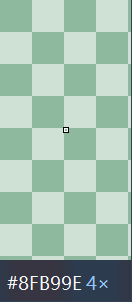

# 原生界面视觉更新

2026-09-21：结果与设置使用浅灰背景、白色卡片、圆角按钮与蓝色主操作；
颜色值使用等宽字体，中文使用 Microsoft YaHei UI。实时和冻结取色浮窗使用
统一的深色配色与分级文字，保留原有像素绘制和命中映射。

所有交互仍为原生 Win32 控件。只读色值可选择，Tab / Enter / Esc、复制重试、
设置验证和仅“应用”时保存的行为保留。行内复制按钮显示简短“复制”，
原生控件名称保留完整格式，供辅助技术区分。

主键现在点击后监听 A–Z、0–9 或 F1–F11，Esc / Tab / 离开控件可取消。
修饰键仍单独选择，按“应用”后才保存；监听只处理设置窗口的按键消息。
已消费的按键保持到释放，避免长按 Enter 或切换焦点时意外应用设置。

实时浮窗进一步缩小为 168×38 DIP，左侧色块贴边铺满高度，HEX / 坐标使用 13 / 10 DIP 字号。
冻结像素区取消外围边距，按快照在初始 4× 下的实际物理像素范围收紧（每轴上限 240 DIP，
并限制在工作区内）；边缘裁剪的快照允许矩形视口。信息栏缩至 24 DIP，色块贴边，
HEX / 倍率使用 13 / 10 DIP 字号。175% 下完整 65×65 快照的窗口为 260×302 物理像素。
极窄缓存保留每轴至少 32 个物理像素，以支持最高倍率；缩放时保留完整整数像素格所需的
少量对称余量，不拉伸图像填充。两种浮窗均移除操作说明，统一放在设置页。
冻结模式窗外左键取消取色，窗口内边框、留白和信息栏继续等待有效选择。

浮窗仅下、右两侧绘制 1 个物理像素的灰蓝边框。信息区采用局部背景模糊，
叠加约 84% 的深色遮罩，呈现轻微透底的磨砂效果；色块和放大像素继续不透明绘制。
背景只在浮窗移动或尺寸 / DPI 改变时刷新，静止与冻结期间使用缓存，不追踪背后动画。
仅在捕获排除设置成功时启用；分配或绘制失败自动退回原有纯色背景。

字体与画刷由窗口持有，字体只在 DPI / Surface 变化时重建；未增加常驻计时器、
输入钩子、动画或额外运行时依赖。本次未重做长时间性能测量。

## 本机检查

- Windows 11，窗口实际 DPI 为 168（175% 缩放）。下方图片为真实原生窗口截图。
- `scripts/verify-windows.ps1` 通过：格式、Clippy、81 项默认测试、x64 Release、
  嵌入 manifest 和 PerMonitorV2 检查。
- 已有 `windows_selection_ui` 桌面冒烟通过，覆盖冻结倍率映射、只读色值、
  按键录入 / F12 拒绝 / Esc / Tab / F10 系统键 / 多键长按与换焦点、
  设置验证、禁止保存与窗口销毁。窗外取消规则通过纯逻辑回归，未扩展为完整发布矩阵。
- 预览的置顶 / 不抢焦点 / 100 次资源释放检查通过：本轮 GDI 为 2，USER 为 2，
  第 25 次与第 100 次均与预热基线一致。两种浮窗均在创建时声明置顶。

## 界面预览

独立预览不注册热键、不安装输入钩子、不写用户配置。取色数据使用合成颜色，
磨砂信息区读取其背后的局部背景；通过生产窗口代码渲染，默认 60 秒后关闭：

```powershell
cargo run --release --example ui-preview -- result
cargo run --release --example ui-preview -- settings
cargo run --release --example ui-preview -- live
cargo run --release --example ui-preview -- frozen
cargo run --release --example ui-preview -- frozen-edge
cargo run --release --example ui-preview -- live 60 --backdrop
```

可在模式后指定存活秒数（1–600）。预览中的“应用”只校验，不保存；
结果窗口的复制按钮在用户主动点击时仍会写入剪贴板。浮窗仅在这个合成预览中
允许截图，正常程序继续排除取色浮窗，避免采到自身画面。
`--backdrop` 会显示一个合成棋盘背景，方便检查磨砂；下方取色浮窗截图使用此背景。

### 取色结果


### 设置


### 实时取色与冻结放大


屏幕边缘的窄快照使用紧凑信息栏，省略重复色块，保留完整 HEX 与倍率：


